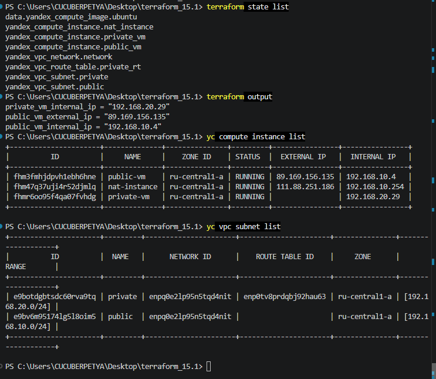
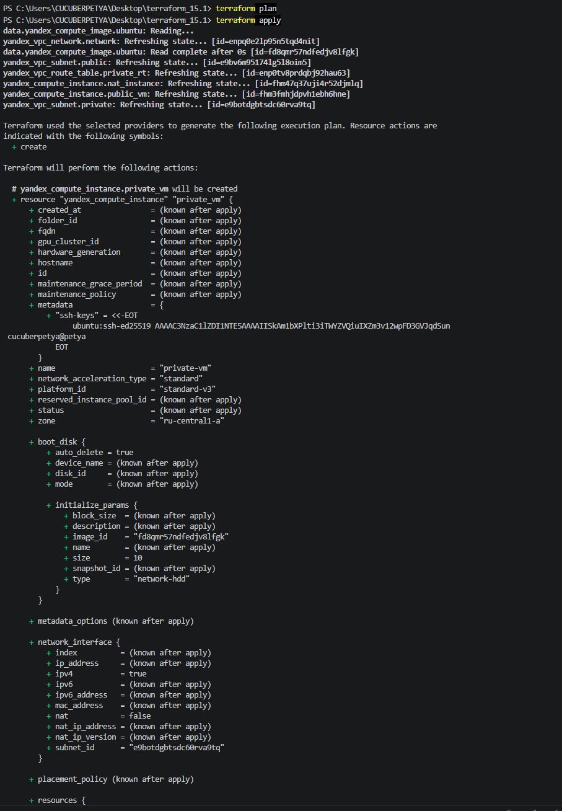
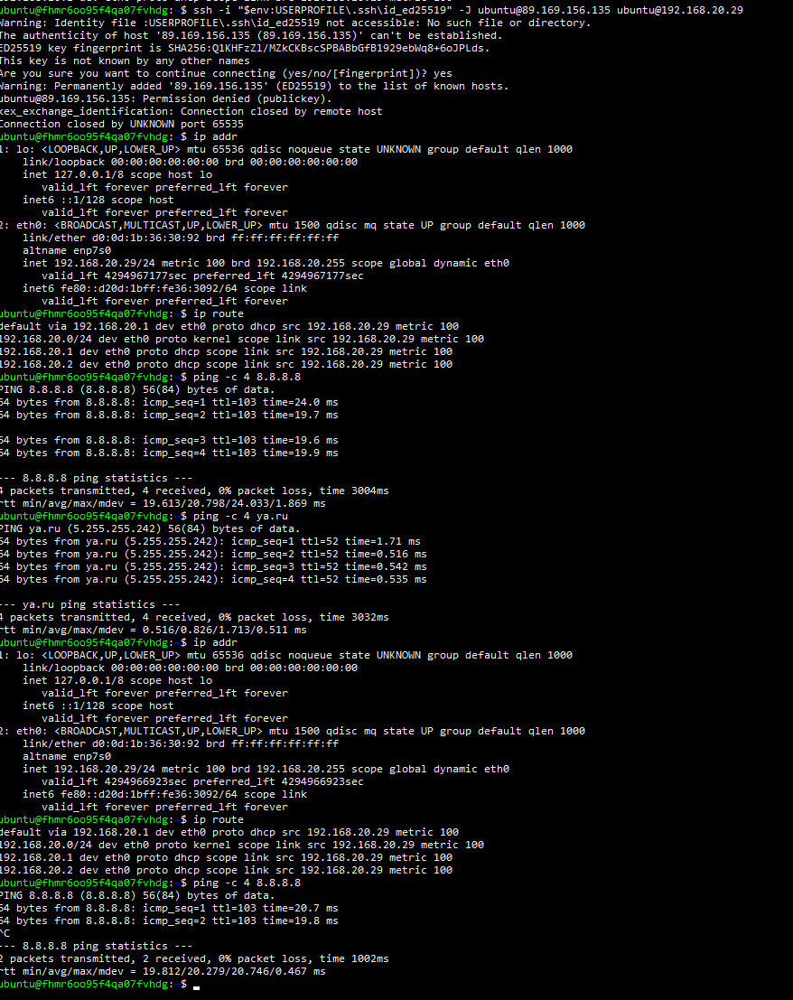

# Домашнее задание к занятию «Организация сети»

## Задание 1. Yandex Cloud

### Созданная инфраструктура

- VPC `netology-network`
- Public subnet `192.168.10.0/24`
- NAT instance `192.168.10.254`
- Public VM с публичным IP
- Private subnet `192.168.20.0/24`
- Private VM без публичного IP
- Таблица маршрутизации:
  `0.0.0.0/0 → 192.168.10.254`

### Terraform

Конфигурация расположена в файлах:

- `providers.tf`
- `variables.tf`
- `main.tf`
- `outputs.tf`

### Созданные ресурсы


---


### Публичная подсеть

Public VM создана в сети `192.168.10.0/24` и имеет публичный IP.

Проверка доступа в интернет:



### Приватная подсеть

Private VM создана в сети `192.168.20.0/24` без публичного IP.

Для private subnet создан маршрут:

```text
0.0.0.0/0 → 192.168.10.254