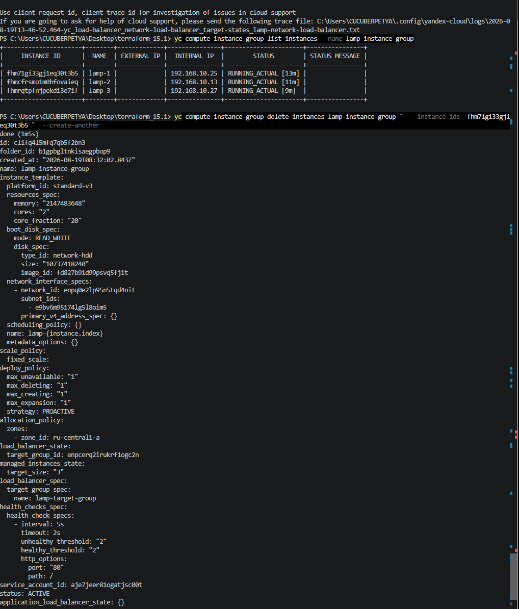
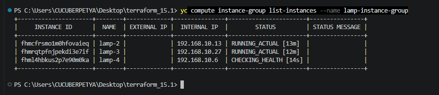
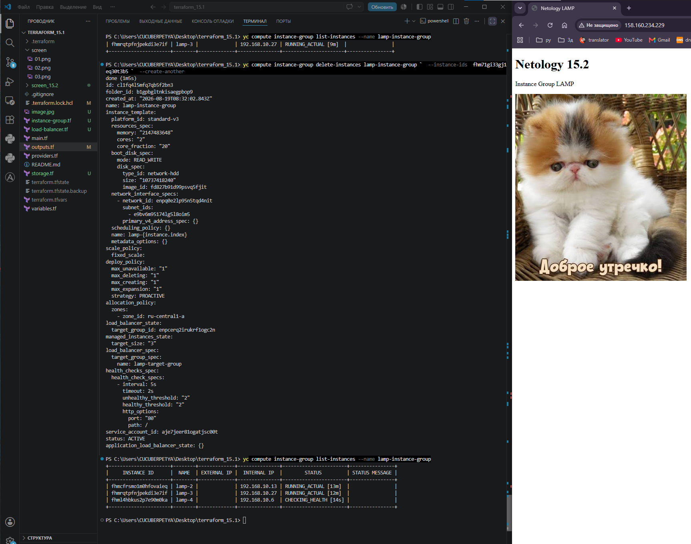
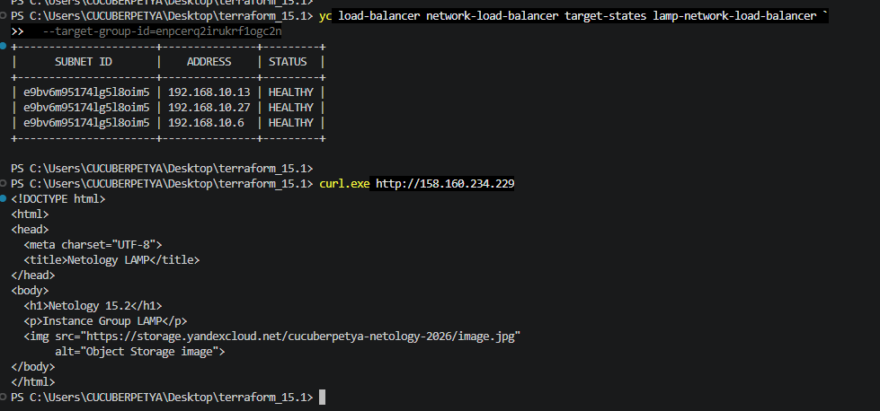

# Домашнее задание к занятию «Вычислительные мощности. Балансировщики нагрузки»

## Задание 1. Yandex Cloud

В рамках задания с помощью Terraform была создана инфраструктура в Yandex Cloud:

* Object Storage bucket с публично доступным изображением;
* Instance Group из трёх ВМ на базе LAMP;
* health check для проверки состояния ВМ;
* Network Load Balancer;
* веб-страница, использующая изображение из Object Storage;
* выполнена проверка отказоустойчивости при удалении одной из ВМ.

---

## 1. Object Storage

Создан бакет:

```text
cucuberpetya-netology-2026
```

В бакет загружен файл:

```text
image.jpg
```

Для объекта разрешён публичный доступ.

Публичный URL:

```text
https://storage.yandexcloud.net/cucuberpetya-netology-2026/image.jpg
```

Проверка доступности объекта:

```powershell
curl.exe -I https://storage.yandexcloud.net/cucuberpetya-netology-2026/image.jpg
```

Получен ответ:

```text
HTTP/1.1 200 OK
Content-Type: image/jpeg
```

---

## 2. Instance Group

Создана группа виртуальных машин:

```text
lamp-instance-group
```

Использован LAMP-образ:

```text
fd827b91d99psvq5fjit
```

Группа имеет фиксированный размер:

```text
3 VM
```

Созданные экземпляры размещены в публичной подсети `192.168.10.0/24`.

Для Instance Group настроен HTTP health check:

```text
port: 80
path: /
interval: 5s
timeout: 2s
healthy_threshold: 2
unhealthy_threshold: 2
```

На веб-странице каждой ВМ размещается изображение из созданного ранее Object Storage.

---

## 3. Network Load Balancer

Создан сетевой балансировщик:

```text
lamp-network-load-balancer
```

Внешний IP балансировщика:

```text
158.160.234.229
```

Балансировщик принимает HTTP-трафик на порту `80` и распределяет его между ВМ из Instance Group.

Для проверки состояния backend-серверов выполнена команда:

```powershell
yc load-balancer network-load-balancer target-states lamp-network-load-balancer `
  --target-group-id=enpcerq2irukrf1ogc2n
```

Все три backend-сервера имеют состояние:

```text
HEALTHY
```



Также выполнена проверка ответа балансировщика:

```powershell
curl.exe http://158.160.234.229
```

Балансировщик успешно возвращает созданную HTML-страницу:

```html
<h1>Netology 15.2</h1>
<p>Instance Group LAMP</p>

```

---

## 4. Проверка отказоустойчивости

Перед удалением в Instance Group находились три работающих экземпляра:

```text
lamp-1
lamp-2
lamp-3
```

Все ВМ находились в состоянии:

```text
RUNNING_ACTUAL
```

Для проверки отказоустойчивости экземпляр `lamp-1` был удалён командой:

```powershell
yc compute instance-group delete-instances lamp-instance-group `
  --instance-ids fhm71gi33gj1eq30t3b5 `
  --create-another
```



Параметр:

```text
--create-another
```

указывает Instance Group создать новый экземпляр взамен удалённого и сохранить установленный размер группы — три ВМ.

После удаления `lamp-1` автоматически был создан новый экземпляр:

```text
lamp-4
```

Сразу после создания новая ВМ находилась в состоянии:

```text
CHECKING_HEALTH
```



При этом остальные экземпляры продолжали работать:

```text
lamp-2   RUNNING_ACTUAL
lamp-3   RUNNING_ACTUAL
lamp-4   CHECKING_HEALTH
```

Несмотря на удаление одного из серверов и создание нового, веб-приложение продолжало быть доступно через Network Load Balancer.



После прохождения health check новый экземпляр был включён в target group балансировщика.

Проверка состояния target group:

```text
192.168.10.13   HEALTHY
192.168.10.27   HEALTHY
192.168.10.6    HEALTHY
```

Таким образом, после удаления одной из ВМ Instance Group автоматически восстановила необходимое количество экземпляров, а Network Load Balancer продолжил обслуживать запросы на оставшихся доступных backend-серверах.

---

# Скриншоты

## 01

---
## 02

---
## 03

---
## 04

---