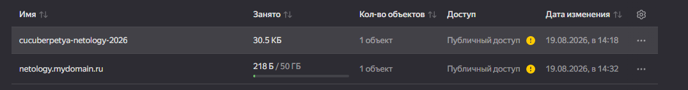
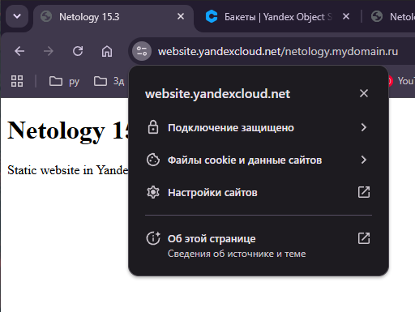
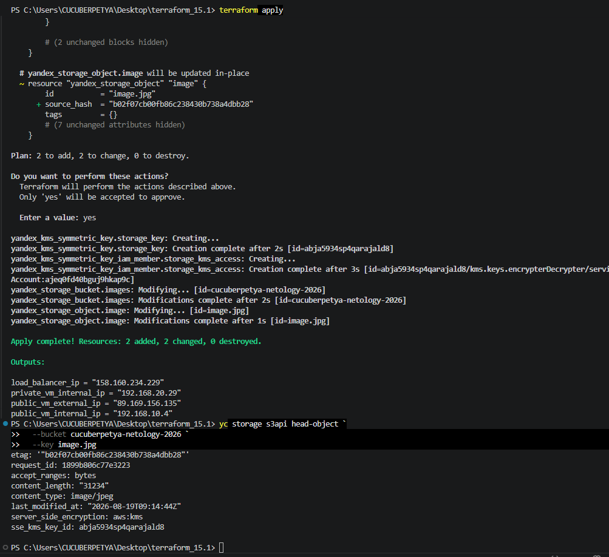

# Домашнее задание «Безопасность в облачных провайдерах»

## Задание 1. Yandex Cloud

В рамках задания было настроено шифрование ранее созданного Object Storage bucket с помощью Yandex KMS.

### KMS и шифрование bucket

Создан симметричный KMS-ключ:

```hcl
resource "yandex_kms_symmetric_key" "storage_key" {
  name              = "storage-kms-key"
  description       = "KMS key for Object Storage encryption"
  default_algorithm = "AES_256"
  rotation_period   = "8760h"
}
```

Сервисному аккаунту предоставлена роль:

```text
kms.keys.encrypterDecrypter
```

Для bucket `cucuberpetya-netology-2026` включено SSE-KMS:

```hcl
server_side_encryption_configuration {
  rule {
    apply_server_side_encryption_by_default {
      kms_master_key_id = yandex_kms_symmetric_key.storage_key.id
      sse_algorithm     = "aws:kms"
    }
  }
}
```

После применения конфигурации:

```text
Plan: 2 to add, 2 to change, 0 to destroy.
Apply complete! Resources: 2 added, 2 changed, 0 destroyed.
```

Для проверки шифрования выполнена команда:

```powershell
yc storage s3api head-object `
  --bucket cucuberpetya-netology-2026 `
  --key image.jpg
```

Результат:

```text
server_side_encryption: aws:kms
sse_kms_key_id: abja5934sp4qarajald8
```

Таким образом, объект `image.jpg` хранится с использованием SSE-KMS.



---

## Статический сайт

Для дополнительной части задания создан отдельный bucket:

```text
netology.mydomain.ru
```

В него загружен `index.html` и включён режим статического веб-хостинга.



Сайт доступен по техническому HTTPS-адресу Yandex Object Storage:

```text
https://website.yandexcloud.net/netology.mydomain.ru
```

Браузер подтверждает защищённое HTTPS-соединение.



Собственный зарегистрированный домен отсутствует, поэтому выпуск отдельного сертификата через Certificate Manager и привязка собственного FQDN не выполнялись. Для проверки HTTPS использован технический адрес Object Storage.

## Итог

В результате задания:

* создан KMS-ключ;
* настроены права на использование ключа;
* включено SSE-KMS шифрование Object Storage;
* проверено фактическое шифрование объекта;
* создан статический сайт;
* проверена работа сайта по HTTPS.
